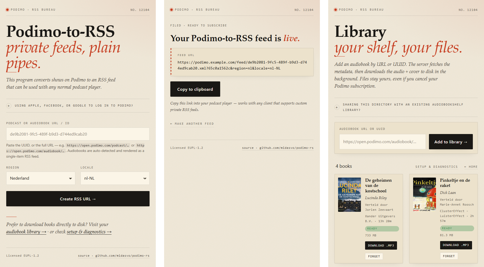

# podimo-rs

Self-hosted proxy that turns your [Podimo](https://podimo.com) shows and
audiobooks into regular RSS feeds, so you can listen in any podcast app or in
Audiobookshelf. A Rust rewrite of [ThijsRay/podimo](https://github.com/ThijsRay/podimo).

<picture>
  <source media="(prefers-color-scheme: dark)" srcset="docs/screenshots-dark.webp">
  
</picture>

## Quick start

```sh
docker run -d --name podimo -p 12104:12104 \
  -e PODIMO_BIND_HOST=0.0.0.0:12104 \
  -e CACHE_DIR=/app/cache -v "$PWD/cache:/app/cache" \
  ghcr.io/midasvo/podimo-rs:latest
```

Open <http://localhost:12104>, enter your Podimo login and a show or audiobook
URL, and subscribe to the feed URL it gives you.

Images are published to `ghcr.io/midasvo/podimo-rs` for linux/amd64 and
linux/arm64: `latest` follows `main`, releases are tagged `X.Y.Z` and `X.Y`.

With Docker Compose:

```yaml
services:
  podimo:
    image: ghcr.io/midasvo/podimo-rs:latest
    restart: unless-stopped
    ports: ["12104:12104"]
    environment:
      PODIMO_BIND_HOST: 0.0.0.0:12104
      PODIMO_HOSTNAME: podimo.example.com # public address shown by the web form
      PODIMO_PROTOCOL: https
      CACHE_DIR: /app/cache
    volumes:
      - ./cache:/app/cache
```

## How it works

| Route | |
| --- | --- |
| `/` | Web form that builds your feed URL. |
| `/feed/<podcast-id>.xml` | Podcast feed. `?limit=N` keeps only the newest N episodes. |
| `/audiobook/<audiobook-id>.xml` | Audiobook as a feed with one episode. |
| `/stream/…/<episode-id>.m4a` or `.mp3` | Episode audio (the feed links here). |
| `/library` | Optional audiobook library (see configuration). |
| `/healthz` | Health check. |

Podimo streams episode audio as HLS, which podcast apps can't download. The
proxy fetches the stream and serves each episode as one file with
[ffmpeg](https://ffmpeg.org). By default that's an `.m4a` with Podimo's own AAC
audio, repackaged without re-encoding. The proxy fetches the whole episode
before it responds (a few seconds), so apps can seek and resume. Finished files
stay in the system temp directory for an hour after their last use, 2 GB at
most. Set `STREAM_FORMAT=mp3` to get 128 kbps MP3 instead, which is streamed
while it's encoded and costs about one CPU core per download. At most 16
episodes download at once, 4 of them as MP3; further requests get `503 Service
Unavailable` with `Retry-After`.

Episode links use the address the feed was fetched from, so one instance serves
both your phone (`https://podimo.example.com`) and an Audiobookshelf container
on the same network (`http://podimo`).

**Behind a reverse proxy**, pass the original `Host` header on and set
`X-Forwarded-Proto` (nginx: `proxy_set_header Host $host;` and
`proxy_set_header X-Forwarded-Proto $scheme;`). If your proxy can't, set
`STREAM_LINKS_FROM_REQUEST=false` so episode links always use
`PODIMO_PROTOCOL://PODIMO_HOSTNAME`.

**Logging in**: by default your credentials are part of the feed URL (HTTP Basic
auth, username `email,region,locale`), so several people can share an instance.
For a personal instance, set `LOCAL_CREDENTIALS=true` with `PODIMO_EMAIL` and
`PODIMO_PASSWORD`; feed URLs then contain no credentials.

## Configuration

Set environment variables or put them in a `.env` file. All options and their
defaults are in [`.env.example`](.env.example). The ones you're most likely to
need:

| Variable | Default | |
| --- | --- | --- |
| `PODIMO_BIND_HOST` | `127.0.0.1:12104` | Listen address. Use `0.0.0.0:12104` in a container. |
| `PODIMO_HOSTNAME`, `PODIMO_PROTOCOL` | `localhost:12104`, `http` | Public address used in the feed URLs the web form shows. |
| `STREAM_FORMAT` | `m4a` | Episode files: `m4a` (original quality, almost no CPU) or `mp3` (plays everywhere, re-encoded). |
| `LOCAL_CREDENTIALS` | `false` | Personal instance: take the login from `PODIMO_EMAIL` and `PODIMO_PASSWORD`. |
| `PODIMO_REGION`, `PODIMO_LOCALE` | `nl`, `nl-NL` | Region and locale of that login: used by the library, and by feeds unless the URL has `?region=` and `?locale=`. |
| `CACHE_DIR` | `./cache` | Cached login tokens and episode lists. |
| `SCRAPER_API`, `ZENROWS_API`, `HTTP_PROXY` | – | Proxy for Podimo's API. Needed when Cloudflare blocks your IP, which is common from data centers. |
| `ENABLE_LIBRARY` | `false` | Download audiobooks to `LIBRARY_DIR` in an Audiobookshelf-compatible layout. Requires `LOCAL_CREDENTIALS=true`. |
| `DEBUG` | `false` | Logs podimo-rs's debug messages, and every setting at startup. |
| `RUST_LOG` | – | Log filter ([`EnvFilter`](https://docs.rs/tracing-subscriber/latest/tracing_subscriber/filter/struct.EnvFilter.html) syntax) replacing the defaults. hyper, reqwest, h2 and rustls stay at `warn` unless it names them. |

Login tokens give full access to a Podimo account. They are cached on disk
unless `STORE_TOKENS_ON_DISK=false`; delete `CACHE_DIR` to forget them.
Passwords are never logged.

To take feeds offline, list podcast IDs in a `.block-list` file; matching feeds
return `410 Gone`, whatever the case or percent-encoding of the URL. Episode
links that podcatchers already have keep working unless you list their episode
IDs too (see [`.block-list.example`](.block-list.example)).

## Development

[](https://codespaces.new/midasvo/podimo-rs)

The repository has a [dev container](https://containers.dev): a Debian
environment with Rust, rustfmt, clippy, rust-analyzer and the ffmpeg that the
tests need. Open it with one of:

- **GitHub Codespaces**: the button above. Runs in the browser, so there's
  nothing to install.
- **Zed**: open the folder and accept the prompt to open it in a dev container.
  Needs Docker.
- **VS Code**: install the Dev Containers extension and run *Dev Containers:
  Reopen in Container*. Needs Docker.

Then, in the container's terminal:

```bash
cargo test                        # all tests
cargo clippy --all-targets        # CI fails on any warning
cargo fmt --all
cargo run                         # the server, on http://localhost:12104
```

`cargo run` reads `.env`; copy `.env.example` to start one. The container keeps
`target/` in a Docker volume per checkout, which is faster than the bind mount
on Windows and macOS and keeps it apart from a native build. To find old ones
to remove, run `docker volume ls --filter name=podimo-rs-target`.

Without the container you need Rust 1.88 or newer, a C compiler, and `ffmpeg`
and `ffprobe` on your `PATH` for the transcode tests.

## License

EUPL-1.2.

```
Copyright 2022-2023 Thijs Raymakers
Copyright 2025-2026 Midas van Oene

Licensed under the EUPL, Version 1.2 or – as soon they will be approved by
the European Commission - subsequent versions of the EUPL (the "Licence");
You may not use this work except in compliance with the Licence.
You may obtain a copy of the Licence at:

https://joinup.ec.europa.eu/software/page/eupl

Unless required by applicable law or agreed to in writing, software
distributed under the Licence is distributed on an "AS IS" basis,
WITHOUT WARRANTIES OR CONDITIONS OF ANY KIND, either express or implied.
See the Licence for the specific language governing permissions and
limitations under the Licence.
```
